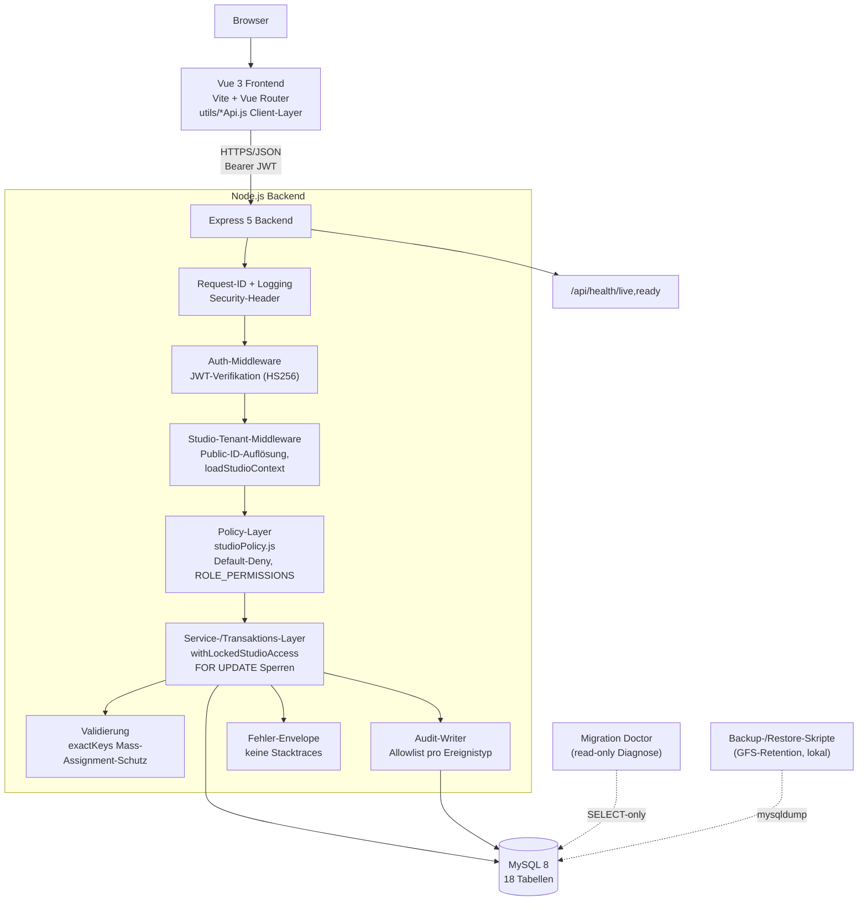
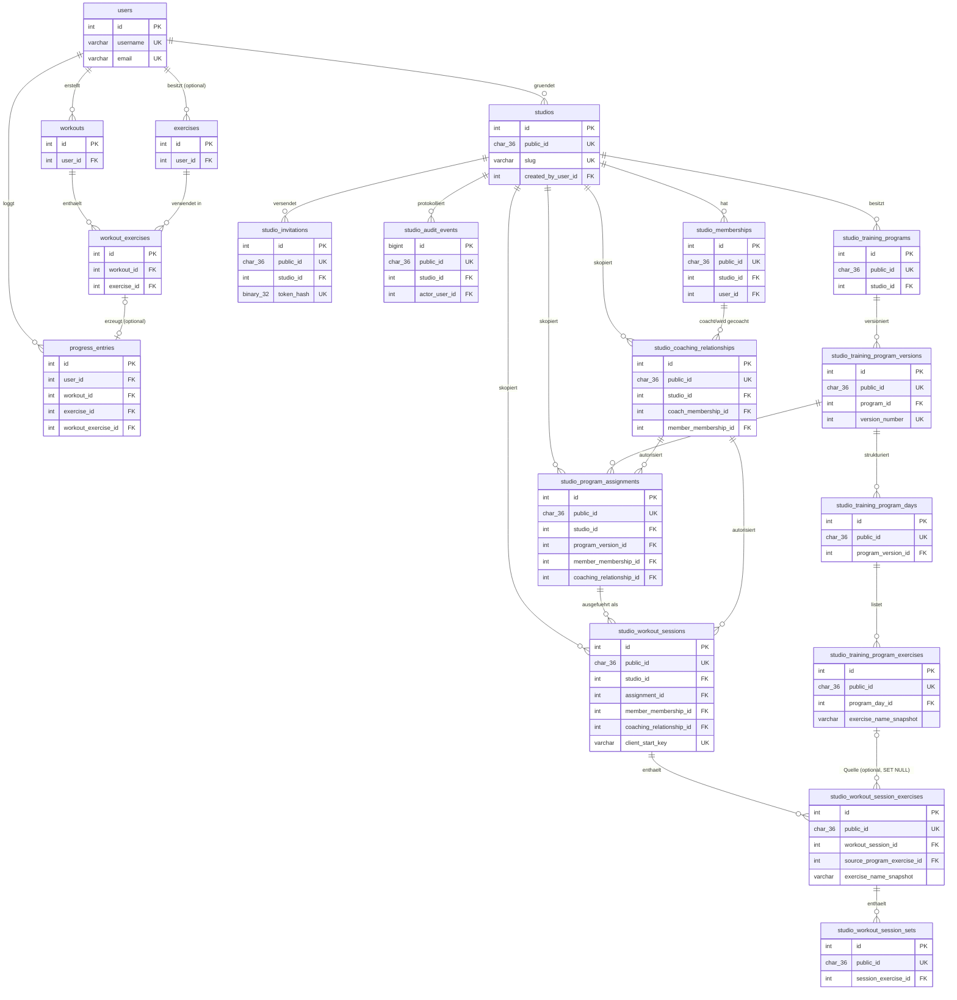

# FitTrack Current-State Audit — Status-Baseline

**Geprüfter Stand:** Branch `main`, HEAD `8a8da30` ("Merge pull request #7 from Limason17/feature/stage-1b2b1-workout-execution-backend"), identisch zu `origin/main` (0 Commits Unterschied). Geprüft am 2026-07-19 auf Windows 11, Node.js v22.17.0, npm 10.9.2, MySQL 8.0 (Docker, Container `fittrack_mysql`, bereits 28h laufend).

Dieser Bericht vertraut keinem früheren Abschlussbericht als alleinigem Nachweis. Jede Aussage stammt aus tatsächlich in dieser Sitzung gelesenem Code, tatsächlich in dieser Sitzung ausgeführten Befehlen/Tests oder einer tatsächlich in dieser Sitzung durchgeführten manuellen Prüfung. Wo eine Aussage nur auf Code-Lektüre beruht (kein automatisierter Test gefunden), ist das explizit vermerkt.

> **Nachtrag (2026-07-20):** Dieser Bericht ist ein eingefrorener Audit-Snapshot zum Stand von PR #7 (Stage 1B.2B1) und wurde bewusst **nicht** rückwirkend umgeschrieben. Seither wurden drei weitere Phasen integriert: Stage 1B.2B2A (Mitglieds-Workout-Ausführungs-UI, PR #9 — schließt die in Abschnitt 1 beschriebene Lücke „keine Oberfläche für Workout-Sessions"), Stage 1B.2B2B (Coach-Ergebnisansicht, kontrollierter Feedback-Flow, vollständige Footer-Entfernung, PR #10 — siehe `STAGE_1B2B2B_COACH_RESULTS_FEEDBACK.md`) und Stage 2A (produktionsfähiger, opt-in SMTP-Einladungsversand — schließt einen der in Abschnitt 1 genannten operativen Pilot-Blocker, siehe `STAGE_2A_PRODUCTION_INVITATION_EMAIL.md`). Für aktuelle Endpunkt-/View-/Test-Zahlen die jeweiligen Stage-Dokumente sowie `FITTRACK_API_CATALOG.md`/`FITTRACK_VIEW_CATALOG.md` konsultieren, nicht die untenstehenden historischen Zahlen.
>
> **Nachtrag (2026-07-22):** Seit diesem Snapshot wurden zusätzlich Stage 2B1 (verschlüsselte lokale Backups), Stage 2B2A (S3-kompatible Off-host-Backup-Mechanik, gegen lokales MinIO verifiziert) integriert, und ein vollständiges **Stage-3A-Local-Pilot-Readiness-Audit** wurde durchgeführt — siehe `STAGE_3A_LOCAL_PILOT_READINESS_AUDIT.md` für die aktuelle, vollständige und evidenzbasierte Bewertung aller vier Rollen (Owner/Admin/Trainer/Member), der Funktionsmatrix, der Datenisolation, des UX-/Accessibility-Stands und der Testzahlen (504 Backend-Tests, 306 Frontend-Tests, 26 Browser-E2E-Tests, alle grün zum geprüften Commit `dc12b10`). Die damals in Abschnitt 11 beschriebene "nicht pilotfähig für Member"-Einschränkung gilt **nicht mehr** — die Workout-Ausführung ist seit Stage 1B.2B2A vollständig nutzbar. Die Gesamtklassifikation von Stage 3A lautet **lokal pilotfähig**. Stage 2B2B (echter externer Off-host-Bucket) wurde weiterhin **nicht begonnen** und bleibt zurückgestellt bis zu einer konkreten Kunden-/Hosting-Entscheidung.
>
> **Nachtrag (2026-07-22, Stage 3B1 Account Self-Service):** Zwei der in Stage 3A als P1 identifizierten Lücken sind geschlossen: Passwort-Selbstverwaltung und verifizierte E-Mail-Änderung sind implementiert, automatisiert getestet (Migration 009, Backend-Unit-/Integrationstests, Frontend-Komponententests, 2 neue Browser-E2E-Tests) und dokumentiert in `STAGE_3B1_ACCOUNT_SELF_SERVICE.md`. Neu: JWTs tragen jetzt einen `authVersion`-Claim, der bei jeder authentifizierten Anfrage gegen `users.auth_version` geprüft wird — Passwortänderung und bestätigte E-Mail-Änderung invalidieren dadurch zuverlässig alle zuvor ausgestellten Tokens, ohne einen Sitzungsspeicher einzuführen. Weiterhin offen (bewusst außerhalb des Scopes dieser Phase): Einladungs-Resend, JWT-Refresh, Geräte-/Sitzungsübersicht, Passwort-vergessen/Reset, Kontolöschung. Stage 2B2B bleibt weiterhin **Deferred until first customer / production deployment**.
>
> **Nachtrag (2026-07-25, Stage 3B2 Session Hardening):** Der in der vorherigen Zeile genannte offene Punkt "JWT-Refresh, Geräte-/Sitzungsübersicht" ist jetzt größtenteils geschlossen. Der reine zustandslose Access-JWT-Flow ist durch serverseitig widerrufbare Authentifizierungssitzungen ersetzt (Migration 010, `user_auth_sessions`/`user_refresh_tokens`): rotierende, einmalig verwendbare Refresh Tokens in einem HttpOnly-Cookie, ein separates lesbares CSRF-Cookie mit Double-Submit- und Token-Bindungs-Prüfung, Origin-Schutz für die drei neuen Cookie-Endpunkte (`POST /api/auth/refresh|logout|logout-all`), Reuse Detection (ein wiederverwendeter, bereits rotierter Refresh Token kompromittiert die gesamte Sitzung), automatische Verdrängung der ältesten Sitzung bei Überschreiten von `AUTH_MAX_ACTIVE_SESSIONS`, sowie eine Schließung des Login-Timing-Seitenkanals (zentraler, einmalig vorab erzeugter Dummy-Bcrypt-Hash für unbekannte Konten). Der Access Token liegt frontendseitig ausschließlich im Arbeitsspeicher (nie mehr `localStorage`); ein Auth-Bootstrap mit stillem Refresh stellt die Sitzung nach einem harten Reload wieder her, Single-Flight verhindert parallele Refresh-Anfragen innerhalb eines Tabs, und eine tokenfreie Cross-Tab-Koordination (`localStorage`-Mutex + `BroadcastChannel`) verhindert, dass zwei Tabs derselben Browsersitzung sich gegenseitig fälschlich als Token-Diebstahl behandeln. Passwortänderung und bestätigte E-Mail-Änderung widerrufen jetzt zusätzlich alle Sitzungen (nicht nur den `auth_version`-Zähler). Details, Bedrohungsmodell und Testzahlen in `STAGE_3B2_SESSION_HARDENING.md`. Der in Abschnitt 7 genannte Timing-Seitenkanal (damals unter "Auffällige Lücken" in `FITTRACK_SECURITY_AND_PRIVACY_STATUS.md` gelistet) gilt damit als **behoben**. Der weiterhin offene Punkt "Geräte-/Sitzungsübersicht" bleibt **teilweise** offen: Logout und Logout-All existieren und sind nutzbar, aber es gibt weiterhin keine vollständige "meine Geräte"-Übersichtsseite mit einzeln benennbaren/widerrufbaren Sitzungen — bewusst außerhalb des Scopes dieser Phase. Der bereits mehrfach dokumentierte prozesslokale Rate Limiter bleibt unverändert eine offene, hier nicht behobene Einschränkung. Stage 2B2B bleibt weiterhin **Deferred until first customer / production deployment**; es wurde für Stage 3B2 keine Cloud-Infrastruktur eingerichtet.
>
> **Nachtrag (2026-07-25, Stage 3C Pilot-UX-Politur):** Der in der Stage-3B1-Zeile genannte offene Punkt "Einladungs-Resend" ist jetzt geschlossen: `POST /api/v1/studios/:studioId/invitations/:invitationId/resend` (Owner/Admin, kein Trainer-Zugriff), inklusive Tokenrotation, In-Place-Erneuerung abgelaufener Einladungen ohne Dubletten, sicherer Kompensation bei Zustellfehlern und einem eigenen Rate-Limiter. Alle 15 zuvor unübersetzten Audit-Event-Typen (Coaching, Programme, Zuweisungen, Workouts, Feedback) sind jetzt in `audit.events` übersetzt, mit sicherem generischem Fallback für künftige unbekannte Typen. Der im Stage-3A-Audit konkret benannte Dropdown-Textabschneidungs-Fehler (`StudioSwitcher.vue`, Sidebar) ist behoben (Tooltip). Die Einladungsliste zeigt jetzt „erstellt am"/„gültig bis" als eigene Spalten und „eingeladen durch". Details, Testzahlen und der vollständige, real gegen den lokalen Stack ausgeführte Admin-Live-Durchlauf in `STAGE_3C_PILOT_UX_POLISH.md`. Kein Migrationsbedarf (weiterhin `applied:10`). Rate-Limiting bleibt weiterhin bewusst auf Login/Registrierung/Account-Aktionen und jetzt zusätzlich Invitation-Resend beschränkt — eine generelle Ausweitung auf alle mutierenden Endpunkte bleibt Stage 3D vorbehalten. Stage 2B2B bleibt weiterhin **Deferred until first customer / production deployment**; es wurde für Stage 3C keine Cloud-Infrastruktur eingerichtet.
>
> **Nachtrag (2026-07-26, Stage 3D Security Hardening):** Der oben mehrfach genannte offene Punkt "prozesslokaler Rate Limiter" ist jetzt geschlossen: ein gemeinsamer, atomarer MySQL-Store (Migration 011, `security_rate_limit_buckets`, HMAC-SHA-256-Schlüssel, nie Klartext) wird von jeder Anwendungsinstanz geteilt, bewiesen mit zwei echten unabhängigen App-Instanzen. Neu abgedeckt: Refresh, Logout-All, Einladung erstellen, Einladung annehmen (zuvor je ganz ohne Limit). CORS ist jetzt vollständig validiert (`CORS_ALLOWED_ORIGINS`, umbenannt von `CORS_ORIGIN`; Produktion verbietet HTTP/localhost/127.\* ausnahmslos) und sowohl per HTTP als auch echt im Browser getestet. Trust-Proxy ist jetzt explizit und fail-closed (`TRUST_PROXY_MODE`). Neu: HSTS (nur Produktion), `Cache-Control: no-store` auf Auth-/Account-/User-Antworten, konfigurierbares JSON-Body-Limit (Default 256kb, war zuvor fest 1mb), Content-Type-Erzwingung (415), gebündelte Startkonfigurationsprüfung. Details, Testzahlen und Kompromisse in `STAGE_3D_SECURITY_HARDENING.md`. Migration 011 angewendet (`applied:11`). Die in Stage 3A vorgeschlagene Blockreihenfolge (3B1 → 3B2 → 3C → 3D) ist damit vollständig abgearbeitet; **nach Stage 3D folgt ausschliesslich Stage 4A — Final Local Acceptance.** Stage 2B2B bleibt weiterhin **Deferred until first customer / production deployment**; es wurde für Stage 3D keine Cloud-Infrastruktur eingerichtet.

---

## 1. Executive Summary

FitTrack ist ein zweistufiges System: (a) eine ursprüngliche, vollständig funktionsfähige persönliche Trainings-App (Übungen, Workouts, Fortschritt) und (b) ein darauf aufgesetztes Multi-Tenant-Studio-System (Stage 1A–1B.2B1) mit Rollen, Coaching-Beziehungen, Trainingsprogrammen, Zuweisungen und — als Backend ohne Oberfläche — Workout-Session-Ausführung mit Satzergebnissen.

Backend-seitig ist der Stand sehr weit: 68 API-Endpunkte, 7 Migrationen, ein konsistentes Policy-/Audit-/Validierungsmuster über alle Phasen hinweg, 232 Backend-Tests (154 Unit, 51 Integration, 27 Migration) und 12 Browser-E2E-/Axe-Tests laufen in dieser Sitzung durchgehend grün, `npm audit` meldet 0 Findings ≥ high in Backend und Frontend, die Migration-Doctor-Diagnose meldet `ready` mit 0 Problemen.

Frontend-seitig besteht eine wichtige Lücke: **Die komplette Workout-Session-Funktion (Sätze protokollieren, Session starten/abschließen, Coach liest Ergebnisse) hat keine Benutzeroberfläche.** Der API-Client existiert, wird aber von keiner einzigen Vue-Komponente aufgerufen. Ein Studio-Mitglied kann sich aktuell kein zugewiesenes Training über die Web-Oberfläche anzeigen lassen und protokollieren.

Betrieblich fehlt für einen echten Produktivbetrieb noch: ein echter, eingerichteter externer Off-host-Bucket (die S3-kompatible Upload-/Download-/Verifikationsmechanik ist seit Stufe 2B2A vorhanden und automatisiert gegen eine lokale MinIO-Testinstanz verifiziert, aber bislang mit keinem echten Cloud-Konto verbunden — das ist Stufe 2B2B vorbehalten), eine getrennte DB-Rolle für Runtime vs. Migration, ein Scheduler für Backup-Erstellung/-Upload und Key-Rotation. Verschlüsselung von Backup-Artefakten, ein produktiver E-Mail-Zustellprovider für Einladungen und ein nachgewiesener Restore-Drill (lokal wie remote) sind bereits vorhanden. Diese Lücken sind größtenteils bereits im Code/den Docs als bewusste Pilot-Grenzen benannt, nicht verschwiegen.

**Kurzfassung der Bereitschaft:** technisch/strukturell weit fortgeschritten und intern gut testbar; für Mitglieder aktuell **nicht pilotfähig**, da die zentrale neue Kernfunktion (Workout-Ausführung) ohne UI ist; für Owner/Trainer/Coaching-Verwaltung **pilotbereit mit Einschränkungen**. Details in Abschnitt 11.

---

## 2. Aktueller Git-/Release-Stand

```
git status --short --branch   → ## main...origin/main   (sauber, keine Änderungen)
git branch --show-current      → main
git rev-list --left-right --count main...origin/main → 0  0   (identisch)
git fetch --all --prune        → keine neuen Refs
```

Integrierte Phasen (verifiziert über `git log --oneline --decorate -40` und die jeweiligen Merge-Commits auf `main`):

| Phase | Merge-Commit | PR |
|---|---|---|
| Stabilisierung Stage 0B/0C | `610c13a`, `1f651fb` | #1, #2 |
| Stage 1A (Tenancy/RBAC Backend) | `4ed8f69` | #3 |
| Stage 1A UI-Grundlage | `1a938c4` | #4 |
| Stage 1B.1 (Coach-Member-Trainingsfluss Backend) | `b1a2d2b` | #5 |
| Stage 1B.2A (Coach-/Programmverwaltungs-UI) | `361b84d` | #6 |
| Stage 1B.2B1 (Studio-Workout-Ausführung Backend) | `8a8da30` (= HEAD) | #7 |

Migrationen `001` bis `007` sind alle im Repository vorhanden (`database/migrations/001_initial_schema.js` … `007_studio_workout_execution.js`) und, siehe Abschnitt 3, auf der lokalen Datenbank vollständig angewendet.

Sonstiger Repository-Zustand:
- 4 vorbestehende Stashes (`stash@{0}` … `stash@{3}`), **unverändert gelassen**, keiner davon betrifft diese Sitzung.
- Ein einziges Arbeitsverzeichnis (`git worktree list` → nur das Hauptverzeichnis).
- Ein Remote (`origin`, `github.com/Limason17/fittrack-ipt7.1.git`).
- `gh` CLI ist in dieser Umgebung **nicht installiert** — `gh pr list`/`gh run list` konnten nicht ausgeführt werden. Der Status des letzten GitHub-Actions-CI-Laufs auf `main` konnte deshalb **nicht** aus der Ferne verifiziert werden. Als Ersatz wurden in dieser Sitzung alle drei CI-Jobs (`backend`, `frontend`, `browser`) inhaltsgleich **lokal** nachvollzogen — siehe Abschnitt 9. Das ist kein Ersatz für einen echten CI-Lauf-Nachweis, aber die bestmögliche verfügbare Evidenz in dieser Umgebung.

---

## 3. Systemarchitektur

Technologie-Inventar (aus `package.json`, `docker-compose.yml`, `.github/workflows/ci.yml`):

- **Frontend:** Vue 3.5, Vue Router 5, Vite 7, Vitest 4, `@vue/test-utils`, Playwright 1.61 (+ `@axe-core/playwright`) für E2E/A11y.
- **Backend:** Node.js/Express 5, `mysql2`, `jsonwebtoken`, `bcryptjs`, `cors`, `dotenv`; Tests über den nativen `node:test`-Runner (kein Jest/Mocha).
- **Datenbank:** MySQL 8.0, additive versionierte Forward-Migrationen (kein ORM).
- **Migrationssystem:** Eigenbau (`backend/migrations/`) mit Advisory-Lock, Checksum-Drift-Erkennung, separatem read-only "Migration Doctor".
- **CI:** GitHub Actions, drei Jobs (Backend+MySQL+Migrationen, Frontend+Build, Chromium-E2E+Axe), Node 22.17.0 exakt gepinnt.
- **Backup/Restore:** Eigenbau-Skripte (`backend/scripts/dbBackup*.js`, `dbRestore.js`) mit GFS-Retention (unverschlüsselt); dieser Pfad ist seit der Stage-2B1-Release-Gate-Härtung in Produktion ausnahmslos gesperrt und überall sonst standardmäßig gesperrt (`ALLOW_LEGACY_UNENCRYPTED_BACKUP` nötig, wirkt nie in Produktion) — er bleibt nur für historische Regressionstests/lokale Läufe nutzbar. **Seit Stage 2B1 zusätzlich und für Produktion ausschließlich zulässig:** ein paralleler, authentifiziert AES-256-GCM-verschlüsselter Pfad (`encryptedBackup{Create,Verify,Restore,Drill}.js`, `.ftbackup`-Format) mit automatisiertem, echt gegen die lokale MySQL-Instanz verifiziertem Restore-Drill, strikten Prozess-Timeouts (Dump/Restore/Docker-Hilfsoperation, inkl. garantierter Bereinigung des entfernten Containerprozesses) und einem von `NODE_ENV` unabhängigen, explizit an den Zielnamen gebundenen Restore-Freigabemodell (`BACKUP_RESTORE_ENABLED=true` + `FITTRACK_RESTORE_ACK=restore:<Ziel>`) — siehe `STAGE_2B1_ENCRYPTED_BACKUP_RESTORE.md`. **Seit Stage 2B2A zusätzlich:** ein providerneutraler, S3-kompatibler Off-host-Upload-/Download-/Verifikationspfad (`encryptedBackupRemote{Upload,List,Download,Verify,Drill}.js`, `backupRemoteConfig.js`, AWS SDK v3, nie eine implizite AWS-Credential-Chain) inklusive vollständigem Remote-Restore-Drill und GFS-Retention-Planung, seit einer anschließenden Release-Gate-Härtung mit einem atomar-bedingten Single-`PutObject` (`IfNoneMatch: "*"`, empirisch gegen echtes MinIO inklusive genuiner Nebenläufigkeit bewiesen) statt einer race-anfälligen `HeadObject`-Vorabprüfung — automatisiert und real gegen eine lokale MinIO-Testinstanz verifiziert, siehe `STAGE_2B2A_S3_OFFHOST_BACKUPS.md`. **Es ist kein echter externer Cloud-Bucket eingerichtet oder verbunden** — das bleibt Stufe 2B2B.

### 3.1 Architekturdiagramm



### 3.2 Datenflussdiagramm (repräsentativer Request: Trainer liest ein gecoachtes Mitglied-Ergebnis)

```mermaid
sequenceDiagram
    participant B as Browser (Vue)
    participant E as Express Route
    participant A as Auth-Middleware
    participant S as Studio-Kontext-Middleware
    participant P as Policy-Layer
    participant SV as Service (FOR UPDATE)
    participant DB as MySQL

    B->>E: GET /coached-members/:id/workout-sessions/:sid (Bearer JWT)
    E->>A: authenticateToken
    A->>A: JWT verify (HS256), nur {id} im Payload
    A-->>E: req.user = {id}
    E->>S: studioContextMiddleware
    S->>DB: SELECT studio+membership WHERE status='active'
    DB-->>S: Zeile oder leer
    alt kein Treffer (fremd/suspendiert/left)
        S-->>B: 404 STUDIO_NOT_FOUND
    else Treffer
        S-->>E: req.studioContext
        E->>P: requireStudioPermission(WORKOUT_RESULT_READ_COACHED)
        P->>P: hasStudioPermission (Rolle + status='active')
        alt fehlt
            P-->>B: 403 INSUFFICIENT_STUDIO_ROLE
        else vorhanden
            E->>SV: workoutSessionService.getCoachedMemberSession
            SV->>DB: BEGIN; SELECT membership FOR UPDATE
            SV->>DB: SELECT coaching_relationship WHERE status='active'
            alt keine aktive Beziehung (auch Owner/Admin!)
                SV-->>B: 404 WORKOUT_SESSION_NOT_FOUND (kein Bypass)
            else aktive Beziehung vorhanden
                SV->>DB: SELECT session+exercises+sets
                SV->>DB: COMMIT
                SV-->>B: 200 workoutSession{...} (Satzresultate)
            end
        end
    end
```

---

## 4. Funktionsmatrix

Status-Legende: **vollständig** (Frontend+Backend+DB+Tests) · **teilweise** · **nur Backend** · **nur Frontend** · **nur dokumentiert** · **nicht vorhanden**.

### Authentifizierung und Konto

| Funktion | Rolle | Frontend | Backend | DB | Auto-Test | Manuell geprüft | Status | Route/API |
|---|---|---|---|---|---|---|---|---|
| Registrierung | jeder | ✅ | ✅ | ✅ | ✅ Unit+Integration+E2E | ✅ (Screenshot) | **vollständig** | `POST /api/users/register` |
| Login | jeder | ✅ | ✅ | ✅ | ✅ | ✅ | **vollständig** | `POST /api/users/login` |
| Logout | eingeloggt | ✅ (lokal, kein Server-Call) | — | — | ✅ (Komponententest) | ✅ | **vollständig** | client-seitig, Token löschen |
| Sessionablauf (JWT 8h) | eingeloggt | ✅ (401→Redirect) | ✅ | — | teilweise (kein Zeit-Mock-Test) | nicht geprüft | **teilweise** | — |
| Passwort-Handling (bcrypt, cost 10) | jeder | — | ✅ | ✅ | ✅ Unit | — | **vollständig (Backend)** | — |
| Profil lesen/ändern | eingeloggt | ✅ | ✅ | ✅ | ✅ | ✅ | **vollständig** | `/api/users/me`, `PUT .../language` |
| Sprache (de/en) | eingeloggt | ✅ | ✅ | ✅ | ✅ | ✅ | **vollständig** | `PUT /api/users/language` |
| Gewichtseinheit (kg/lb) | eingeloggt | ✅ | ✅ | ✅ | ✅ | ✅ | **vollständig** | `PUT /api/users/weight-unit` |
| Distanzeinheit (km/mi) | eingeloggt | ✅ | ✅ | ✅ | ✅ | ✅ | **vollständig** | `PUT /api/users/distance-unit` |
| 401-Verhalten | jeder | ✅ (globaler Interceptor) | ✅ | — | ✅ | ✅ | **vollständig** | `utils/api.js` |
| 403-Verhalten | eingeloggt | ⚠️ uneinheitlich, kein globaler Interceptor, nicht jede View reconciled | ✅ konsistent | — | ✅ (Backend) | ✅ | **teilweise** (Backend vollständig, Frontend uneinheitlich) | — |

### Persönlicher Bereich

| Funktion | Rolle | Frontend | Backend | DB | Auto-Test | Manuell | Status | Route/API |
|---|---|---|---|---|---|---|---|---|
| Persönliches Dashboard | eingeloggt | ✅ | ✅ | ✅ | teilweise | ✅ | **vollständig** | `/` |
| Übungen (global+eigen) | eingeloggt | ✅ | ✅ | ✅ | ✅ | ✅ | **vollständig** | `/exercises` |
| Workout-Erstellung/-Bearbeitung | eingeloggt | ✅ | ✅ | ✅ | ✅ Component+Integration+E2E | ✅ | **vollständig** | `/workouts` |
| Workout-Historie (Kalender) | eingeloggt | ✅ | ✅ | ✅ | ✅ | ✅ | **vollständig** | `/workouts` |
| Fortschritt (manuell+abgeleitet) | eingeloggt | ✅ | ✅ | ✅ | ✅ | ✅ | **vollständig** | `/progress` |
| 1RM-/Messwertlogik | eingeloggt | ✅ (Anzeige) | ✅ (Berechnung) | ✅ | ✅ | ✅ | **vollständig** | `/api/progress/summary` |
| Persönliche Datenisolation | eingeloggt | ✅ (nie fremde Daten sichtbar) | ✅ (`WHERE user_id=?` überall) | ✅ (kein `studio_id` auf Personentabellen) | ✅ E2E ("zwei Browserkontexte sehen nur eigene Daten") | ✅ | **vollständig** | — |

### Studio-Grundlage

| Funktion | Rolle | Frontend | Backend | DB | Auto-Test | Manuell | Status | Route/API |
|---|---|---|---|---|---|---|---|---|
| Studio erstellen | jeder | ✅ | ✅ | ✅ | ✅ | ✅ | **vollständig** | `/studios/new` |
| Mehrere Studios pro Benutzer | jeder | ✅ | ✅ | ✅ | ✅ | ✅ | **vollständig** | `/studios` |
| Workspace-Wechsel | eingeloggt | ✅ (StudioSwitcher) | — | — | teilweise | ✅ | **vollständig** | client-seitig |
| Rollen owner/admin/trainer/member | Studio-Mitglied | ✅ (rollen-gated Nav) | ✅ (Policy) | ✅ (CHECK-Constraint) | ✅ | ✅ | **vollständig** | — |
| Membership-Status (invited/active/suspended/left) | Owner/Admin | ✅ | ✅ | ✅ | ✅ | teilweise (suspendiert nicht visuell geprüft) | **vollständig** | `/studios/:id/members` |
| Studioeinstellungen | Owner/Admin | ✅ | ✅ | ✅ | ✅ | ✅ | **vollständig** | `/studios/:id/settings` |
| Mitgliederliste | Owner/Admin/Trainer | ✅ | ✅ | ✅ | ✅ | ✅ | **vollständig** | `/studios/:id/members` |
| Einladungen erstellen | Owner/Admin | ✅ | ✅ | ✅ | ✅ | ✅ | **vollständig** | `/studios/:id/invitations` |
| Einladungsannahme | eingeladener Benutzer | ✅ | ✅ | ✅ | ✅ | ✅ | **vollständig** | `/invitations/:token` |
| Einladungswiderruf | Owner/Admin | ✅ | ✅ | ✅ | ✅ | teilweise | **vollständig** | `/studios/:id/invitations` |
| Owner-Invariante (letzter Owner geschützt) | Owner | — (kein UI-Hinweis, nur Backend-Fehler) | ✅ | ✅ | ✅ inkl. Race-Test | nicht geprüft | **vollständig (Backend), UI ohne proaktiven Hinweis** | `PATCH .../memberships/:id` |
| Audit-Ansicht | Owner/Admin | ✅ | ✅ | ✅ | ✅ | ✅ | **vollständig** | `/studios/:id/audit` |

### Coaching und Trainingsprogramme

| Funktion | Rolle | Frontend | Backend | DB | Auto-Test | Manuell | Status | Route/API |
|---|---|---|---|---|---|---|---|---|
| Coaching-Beziehung erstellen/beenden | Owner/Admin | ✅ | ✅ | ✅ | ✅ | ✅ | **vollständig** | `/studios/:id/coaching` |
| Trainer sieht nur eigene Mitglieder | Trainer | ✅ (Backend-gefiltert) | ✅ | ✅ | ✅ | nicht geprüft | **vollständig** | — |
| Programmliste/-erstellung | Owner/Admin/Trainer | ✅ | ✅ | ✅ | ✅ | ✅ | **vollständig** | `/studios/:id/training-programs` |
| Draft-Version, Tage, Übungen | Owner/Admin/Trainer | ✅ | ✅ | ✅ | ✅ E2E | ✅ | **vollständig** | Program-Builder |
| Sortierung (Tage/Übungen) | Owner/Admin/Trainer | ✅ | ✅ | ✅ | ✅ | nicht geprüft | **vollständig** | — |
| Veröffentlichung, danach unveränderlich | Owner/Admin/Trainer | ✅ | ✅ (auch für Owner gesperrt) | ✅ | ✅ | ✅ | **vollständig** | `.../publish` |
| Neue Version, Programm archivieren | Owner/Admin/Trainer | ✅ | ✅ | ✅ | ✅ | ✅ | **vollständig** | Program-Builder |
| Programmzuweisung mit expliziter Beziehung | Owner/Admin/Trainer | ✅ | ✅ | ✅ | ✅ | ✅ | **vollständig** | `/studios/:id/assignments` |
| Zuweisung abschließen/abbrechen | Owner/Admin/Trainer | ✅ | ✅ | ✅ | ✅ | nicht geprüft | **vollständig** | `/studios/:id/assignments` |
| "Mein Trainingsplan" (Member) | Member | ✅ | ✅ | ✅ | ✅ | ✅ | **vollständig** | `/studios/:id/my-training-plan` |

### Studio-Workout-Ausführung (Stage 1B.2B1)

| Funktion | Rolle | Frontend | Backend | DB | Auto-Test | Manuell | Status | Route/API |
|---|---|---|---|---|---|---|---|---|
| Session starten (idempotent) | Member | ❌ **kein UI** | ✅ | ✅ | ✅ Unit+Integration | ❌ (nur via Skript/API getestet) | **nur Backend** | `POST .../workout-sessions` |
| Assignment-/Datumsfenster-/Beziehungsprüfung | Member | ❌ | ✅ | ✅ | ✅ | ✅ (über API) | **nur Backend** | — |
| Programmtag-Auswahl, Snapshot-Erstellung | Member | ❌ | ✅ | ✅ | ✅ | ✅ | **nur Backend** | — |
| Sets vorbelegen, zusätzliche Sets | Member | ❌ | ✅ | ✅ | ✅ | ✅ | **nur Backend** | `POST .../sets` |
| Satzresultate speichern (Gewicht/Wdh/RPE/...) | Member | ❌ | ✅ | ✅ | ✅ | ✅ | **nur Backend** | `PATCH .../sets/:id` |
| Übungen aktualisieren | Member | ❌ | ✅ | ✅ | ✅ | ✅ | **nur Backend** | `PATCH .../exercises/:id` |
| Revisionen/Optimistic Concurrency | Member | ❌ | ✅ | ✅ | ✅ inkl. echter Konkurrenz-Test | ✅ | **nur Backend** | — |
| Konfliktantworten (`*_CONFLICT`) | Member | ❌ | ✅ | ✅ | ✅ | ✅ | **nur Backend** | — |
| Idempotenz über `clientStartKey` | Member | ❌ | ✅ | ✅ | ✅ | ✅ | **nur Backend** | — |
| Session abschließen/abbrechen | Member | ❌ | ✅ | ✅ | ✅ | ✅ | **nur Backend** | `.../complete`, `.../abort` |
| Member liest eigene Sessions | Member | ❌ | ✅ | ✅ | ✅ | ✅ | **nur Backend** | `GET .../workout-sessions/me` |
| Coach liest autorisierte Sessions | Trainer/Owner/Admin mit Beziehung | ❌ | ✅ | ✅ | ✅ | ✅ | **nur Backend** | `GET .../coached-members/...` |
| Owner/Admin ohne Beziehung: kein Zugriff | Owner/Admin | n/a (kein UI) | ✅ (kein Bypass) | ✅ | ✅ | ✅ | **nur Backend** | — |
| Persönliche Tabellen bleiben getrennt | alle | n/a | ✅ | ✅ | ✅ | ✅ | **nur Backend** | — |

**Ausdrücklich festgehalten:** Für die gesamte Zeile "Studio-Workout-Ausführung" gibt es **keine** Vue-Komponente, **keine** Route und **keinen** Aufrufer von `workoutSessionApi.js` im Frontend (siehe `FITTRACK_VIEW_CATALOG.md`). Jede Zeile in dieser Tabelle wurde ausschließlich über automatisierte Backend-Tests und direkte API-Aufrufe verifiziert, nie über die Web-Oberfläche, weil es dafür keine gibt.

---

## 5. Rollen- und Berechtigungsmatrix

Vollständige, mit Code-Zeilen und Testnamen belegte Matrix (10 Akteurstypen × 18 Berechtigungen) in `FITTRACK_SECURITY_AND_PRIVACY_STATUS.md` Abschnitt "RBAC" zusammengefasst; die volle Rohmatrix mit Zitaten ist wegen ihres Umfangs im Recherche-Protokoll dieser Sitzung dokumentiert. Kernaussagen:

- Jeder nicht-aktive Zustand (fremd, suspendiert, ausgeschieden) führt zum **identischen** 404 `STUDIO_NOT_FOUND` — die UI-Sichtbarkeit einer Studio-Navigation und die tatsächliche Backend-Berechtigung sind getrennte Ebenen: Ein Sidebar-Link wird per `v-if` ausgeblendet, aber selbst bei direktem URL-Aufruf blockiert das Backend unabhängig davon identisch.
- Owner/Admin haben bestätigte Bypässe bei: Sichtbarkeit aller Coaching-Beziehungen/Zuweisungen, Zuweisung über beliebige aktive Beziehung, keine Zielrollenbeschränkung bei der Mitgliederverwaltung (nur Admin ist eingeschränkt).
- Owner/Admin haben **keinen** Bypass bei: Lesen von Workout-Ergebnissen eines Mitglieds (erfordert immer eine eigene aktive Coaching-Beziehung), Bearbeiten veröffentlichter Programmversionen, der Owner-Invarianten-Prüfung, dem Selbstbeförderungsschutz.
- Rollenfrische: Das JWT trägt keine Rolle; jede Operation lädt und sperrt die Akteurs-Mitgliedschaft live per `FOR UPDATE` vor jeder Berechtigungsprüfung — eine Suspendierung wirkt auf die nächste Anfrage sofort, nicht erst nach Tokenablauf.

---

## 6. Datenmodell

18 Tabellen über vier Phasen (vollständige Spalten-/Constraint-Liste in `FITTRACK_SECURITY_AND_PRIVACY_STATUS.md` und im Recherche-Protokoll):

- **Basis/persönlich** (Migration 001–004): `users`, `exercises`, `workouts`, `workout_exercises`, `progress_entries`, plus `schema_migrations` (vom Migrations-Runner selbst angelegt, nicht Teil von 001-007).
- **Stage 1A** (005): `studios`, `studio_memberships`, `studio_invitations`, `studio_audit_events`.
- **Stage 1B.1** (006): `studio_coaching_relationships`, `studio_training_programs`, `studio_training_program_versions`, `studio_training_program_days`, `studio_training_program_exercises`, `studio_program_assignments`.
- **Stage 1B.2B1** (007): `studio_workout_sessions`, `studio_workout_session_exercises`, `studio_workout_session_sets`.

**Bestätigt durch Quellcode-Lektüre aller sieben Migrationen:**
1. Keine der fünf persönlichen Tabellen besitzt eine `studio_id`-Spalte — vollständige strukturelle Trennung.
2. `studio_training_program_exercises.exercise_name_snapshot` ist eine reine Text-Snapshot-Spalte ohne Fremdschlüssel zur persönlichen `exercises`-Tabelle.
3. `studio_workout_session_exercises` trägt einen eigenen, vollständigen Snapshot (nicht nur einen Verweis) und `studio_workout_session_sets` hat exakt einen Fremdschlüssel — zur eigenen Session-Übung — und referenziert niemals `workout_exercises` oder `progress_entries`.

Alle sechs neuen Foreign Keys auf `studio_workout_sessions` sind (bis auf die reine Herkunftsangabe `source_program_exercise_id`, `SET NULL`) bewusst `ON DELETE CASCADE`, um den in Stage 1B.1 gefundenen FK-Reihenfolge-Fehler beim Studio-Löschen proaktiv zu vermeiden.

### 6.1 ER-Diagramm



---

## 7. Sicherheitsstatus

Siehe `FITTRACK_SECURITY_AND_PRIVACY_STATUS.md` (vollständig). Kernaussage: Authentifizierung, Tenant-Isolation, RBAC-Default-Deny, Einladungssicherheit, Eingabevalidierung, Fehler-Envelope, Logging und Audit-Redaktion sind alle **implementiert und automatisiert getestet**. Neun konkrete, nicht-kritische Lücken sind identifiziert und dort priorisiert aufgeführt (u. a. fehlende Backup-Verschlüsselung, fehlende Off-host-Kopie, ein Timing-Seitenkanal bei der Login-Enumeration, tote Policy-Code mit Bypass-Semantik).

## 8. Datenschutzstatus

Siehe `FITTRACK_SECURITY_AND_PRIVACY_STATUS.md`, Abschnitt "Datenschutzklassifikation". Die Satzresultate (`studio_workout_session_sets`) sind als sensibelste Datenklasse (P4) identifiziert, mit der striktesten Zugriffsregel im System (kein Owner-/Admin-Bypass) und explizit nachgewiesener Abwesenheit in Logs/Audit. Es existiert **kein** Recht-auf-Löschung-/Anonymisierungsmechanismus für Benutzerdaten irgendwo im Code — ein offener Punkt für einen echten Produktivbetrieb, unabhängig von der technischen Reife.

## 9. Teststatus

Alle Zahlen stammen aus tatsächlich in dieser Sitzung ausgeführten Befehlen (Commit `8a8da30`, Windows 11, Node v22.17.0):

| Suite | Befehl | Ergebnis | Laufzeit |
|---|---|---|---|
| Backend Unit | `npm run test:unit` (Teil von `npm test`) | **154/154 grün** | ~1,5s |
| Backend Integration | `npm run test:integration` | **51/51 grün** | ~30s |
| Backend Migration/Doctor | `npm run test:migrations` | **27/27 grün** | ~30s |
| Backend Syntax-Check | `npm run test:syntax` | **118/118 Dateien grün** | <1s |
| Backend `npm audit --audit-level=high` | — | **0 Findings** | — |
| Frontend Unit/Komponenten | `npm run test:run` | **147/147 grün, 24 Dateien** | ~23s |
| Frontend Produktionsbuild | `npm run build` (`VITE_API_BASE_URL=/api`) | **erfolgreich** (bricht unter Git-Bash wegen MSYS-Pfadumwandlung von `/api` ab — funktioniert korrekt unter PowerShell/CI; kein Produktbug, siehe unten) | ~4-6s |
| Frontend `npm audit --audit-level=high` | — | **0 Findings** | — |
| Browser-E2E + Axe (Chromium) | `npm run test:e2e` | **12/12 grün** (`accessibility.spec.js` ×6, `auth.spec.js` ×2, `studios.spec.js` ×1, `studioTraining.spec.js` ×1, `training.spec.js` ×2) | ~1,4min |
| Firefox/WebKit-E2E | `npm run test:e2e:extra` | **nicht ausgeführt in dieser Sitzung** — Browser-Binaries wurden nicht separat installiert/geprüft | — |

**Migration Doctor** (`npm run db:migrate:doctor`): `state: "ready"`, `code: "MIGRATION_DOCTOR_OK"`, `exitCode: 0`, `summary: {applied:7, pending:0, dirty:0, drift:0, unknown:0, schemaIssues:0, ledgerIssues:0}`.

**Health-Endpunkte** gegen den bereits laufenden lokalen Backend-Prozess (Port 3001, von außerhalb dieser Sitzung gestartet — siehe Abschnitt 13): `GET /api/health/live` → HTTP 200, `GET /api/health/ready` → HTTP 200 `{"status":"ready"}`.

**Anmerkung zum Frontend-Build-"Fehler":** Der erste Build-Versuch über den Bash-Tool schlug mit einer Vite-Fehlermeldung fehl. Ursache war **keine Anwendungslogik**, sondern eine bekannte Eigenheit von Git Bash unter Windows (MSYS-Pfadkonvertierung): Ein Shell-Environment-Variablenwert `/api` wird von der Git-Bash-Laufzeit automatisch in einen Windows-Dateisystempfad umgeschrieben, bevor er beim Kindprozess ankommt (verifiziert durch direkten `node -e`-Test). Über PowerShell (wie in der echten GitHub-Actions-CI) gesetzt, baut das Projekt fehlerfrei. Dies ist im Bericht ausdrücklich als Testumgebungs-Artefakt und nicht als Produktbefund vermerkt.

**GitHub-Actions-CI selbst konnte nicht ferngeprüft werden** (kein `gh` CLI verfügbar). Alle drei CI-Jobs wurden aber inhaltsgleich lokal nachvollzogen: Backend-Suite+Migrationen+Doctor+Audit (Job "Backend, MySQL und Migrationen"), Frontend-Tests+Build+Audit (Job "Frontend-Tests und Produktionsbuild"), Chromium-E2E+Axe (Job "Chromium-E2E und Accessibility") — alle mit identischem Ergebnis wie oben tabelliert.

## 10. Betriebsstatus

| Bereich | Status |
|---|---|
| Lokaler Start (Docker+Backend+Frontend) | **lokal funktionierend**, in dieser Sitzung verifiziert (Backend bereits laufend auf Port 3001, Frontend auf Port 5173, beide extern von dieser Sitzung gestartet, gegen sie getestet) |
| Migrationen/Migration Doctor | **im Code vorhanden, lokal getestet, dokumentiert** — `ready`, siehe Abschnitt 9 |
| Health/Readiness | **im Code vorhanden, lokal getestet** |
| Auto-Migrate | **im Code vorhanden**, in dieser lokalen Konfiguration deaktiviert (`FITTRACK_AUTO_MIGRATE=false`) — Standardeinstellung laut Doku ist ebenfalls "aus" |
| Tägliche Backups + GFS-Retention | **im Code vorhanden, automatisiert getestet**, lokal nicht in dieser Sitzung ausgeführt (kein produktiver Lauf angefordert) |
| Off-host-Backup-Kopie | **Mechanik seit Stage 2B2A vorhanden und automatisiert getestet (lokale MinIO-Instanz), kein echter externer Bucket eingerichtet** — Stufe 2B2B verbindet einen echten Cloud-Bucket |
| Restore-Drill (verschlüsselter Pfad) | **nachgewiesen** — automatisierter Drill (`db:backup:drill`) sowie ein manueller Lauf mit synthetischem Schlüssel gegen die lokale MySQL-Instanz, jeweils inkl. Migration Doctor und Zeilenzahlvergleich, siehe `STAGE_2B1_ENCRYPTED_BACKUP_RESTORE.md`. Restore erfordert seit der Release-Gate-Härtung eine von `NODE_ENV` unabhängige, explizite Freigabe (`BACKUP_RESTORE_ENABLED=true` + zielgebundene Bestätigung). |
| Produktions-E-Mail-Provider für Einladungen | **nicht eingerichtet** — Code verweigert produktive Einladungen bewusst fail-closed ohne einen |
| Getrennte DB-Rollen (Runtime vs. Migration) | **nur dokumentiert als Absicht**, im Code eine einzige Rolle |
| TLS/Reverse-Proxy | **nur dokumentiert** — bewusst als Infrastrukturaufgabe außerhalb des Repositorys |
| Monitoring/Alerting | **nicht eingerichtet** — nur Health-Endpunkte plus dokumentierte, nicht automatisierte Reaktionsprozesse |
| CI/CD (GitHub Actions) | **im Code vorhanden** (drei Jobs), Live-Status in dieser Sitzung nicht fernprüfbar (kein `gh` CLI) |
| Rollback-Grenzen | **nur dokumentiert** (`docs/MIGRATION_RECOVERY.md`), nicht in dieser Sitzung geübt |

## 11. Pilot-/Verkaufsbereitschaft

Skala: nicht vorhanden · Proof of Concept · technisch vorhanden · intern testbar · pilotbereit mit Einschränkungen · verkaufsnah · produktionsreif.

| Dimension | Bewertung | Begründung |
|---|---|---|
| Technische Stabilität | **intern testbar** | 232 Backend- + 147 Frontend- + 12 E2E-Tests grün, Migration Doctor sauber; keine produktive Lasttest-/Monitoring-Evidenz |
| Datenmodell | **pilotbereit mit Einschränkungen** | Sauber normalisiert, Snapshot-Muster konsequent angewendet, aber kein Löschkonzept für Nutzerdaten |
| Sicherheit | **pilotbereit mit Einschränkungen** | Starkes Default-Deny/Tenant-Isolation/Audit-Fundament; Backup-Verschlüsselung mit gehärtetem Restore-Freigabemodell und Prozess-Timeouts seit Stage 2B1 vorhanden; weiterhin offene Punkte: DB-Rollentrennung, Timing-Seitenkanal |
| Datenschutzarchitektur | **pilotbereit mit Einschränkungen** | Klare Klassifikation und konsequente Zugriffskontrolle für die sensibelste Datenklasse (P4), aber kein Lösch-/Anonymisierungspfad |
| UX | **intern testbar** | Konsistentes Design-System, Loading/Empty/Error-States durchgängig vorhanden; 403-Behandlung im Frontend uneinheitlich (nicht jede View reconciled) |
| Funktionsumfang für Member | **technisch vorhanden, nicht nutzbar** | Workout-Ausführung — die für ein Mitglied zentrale neue Funktion — hat keine UI |
| Funktionsumfang für Trainer | **pilotbereit mit Einschränkungen** | Coaching, Programmerstellung, Zuweisung vollständig nutzbar; Ergebnis-Einsicht (Coach-Resultatzugriff) nur backend-seitig vorhanden |
| Funktionsumfang für Studio-Owner | **pilotbereit mit Einschränkungen** | Studio-/Mitglieder-/Einladungsverwaltung vollständig nutzbar und getestet |
| Betrieb | **technisch vorhanden** | Backup-/Migrations-Tooling vorhanden und getestet, verschlüsselter Pfad mit nachgewiesenem Restore-Drill, Prozess-Timeouts und zielgebundener Restore-Freigabe seit Stage 2B1; S3-kompatible Off-host-Mechanik mit Remote-Restore-Drill seit Stage 2B2A (nur gegen lokale MinIO verifiziert); weiterhin offen: echter externer Bucket, Scheduler, Monitoring |
| Supportfähigkeit | **intern testbar** | Strukturierte Logs mit Request-ID, aber kein zentrales Log-Aggregations-/Ticketing-System |
| Pilotfähigkeit (gesamt) | **pilotbereit mit Einschränkungen für Owner/Trainer, nicht pilotfähig für Member-Workout-Ausführung** | Ein echter Pilotbetrieb bräuchte mindestens die Workout-Ausführungs-UI (Stage 1B.2B2) |
| Verkaufsfähigkeit | **nicht verkaufsnah** | Fehlende Kernfunktion (Workout-Logging-UI) und ein noch nicht eingerichteter echter Off-host-Bucket (Mechanik seit Stage 2B2A vorhanden, aber ungenutzt ohne echtes Cloud-Konto) sind harte Blocker für einen zahlenden Kunden |

## 12. Bekannte Risiken

**Kritisch (Pilot-Blocker):**
1. Keine Workout-Session-UI — die zentrale neue Funktion ist für Mitglieder unbenutzbar.
2. Kein Produktions-E-Mail-Provider — Einladungen funktionieren in Produktion nicht.
3. Kein echter Off-host-Bucket verbunden — RPO-Ziel bei Hostverlust weiterhin nicht erfüllbar; die S3-kompatible Upload-/Download-Mechanik ist seit Stage 2B2A vorhanden und automatisiert gegen eine lokale MinIO-Testinstanz verifiziert, aber mit keinem echten Cloud-Konto verbunden (Stufe 2B2B).

**Nicht kritisch, aber relevant:** siehe Abschnitt 14 (`FITTRACK_SECURITY_AND_PRIVACY_STATUS.md` "Auffällige Lücken") — DB-Rollentrennung, Timing-Seitenkanal, CORS ungetestet, toter Policy-Code, kein Löschkonzept, uneinheitliche Frontend-403-Behandlung. Backup-Verschlüsselung und ein automatisierter, verifizierter Restore-Drill sind seit Stage 2B1 vorhanden, und die Release-Gate-Härtung hat den alten unverschlüsselten Backup-Pfad in Produktion vollständig gesperrt, das Restore-Freigabemodell von `NODE_ENV` entkoppelt und strikte Prozess-Timeouts für alle externen Dump-/Restore-/Docker-Aufrufe eingeführt (siehe `STAGE_2B1_ENCRYPTED_BACKUP_RESTORE.md`). Seit Stage 2B2A ist zusätzlich eine S3-kompatible Off-host-Upload-/Download-/Retention-Mechanik mit vollständigem Remote-Restore-Drill vorhanden, real gegen eine lokale MinIO-Testinstanz verifiziert (siehe `STAGE_2B2A_S3_OFFHOST_BACKUPS.md`); ein echter externer Cloud-Bucket, ein Scheduler für den verschlüsselten Pfad und DB-Rollentrennung bleiben weiterhin offen.

## 13. Empfohlene nächste Schritte

Siehe eigenständiges Dokument `FITTRACK_NEXT_PHASE_RECOMMENDATION.md`.

---

## Anhang: Laufzeitkonfiguration dieser Prüfung (ohne Secrets)

```
NODE_ENV=development
PORT=3001 (Backend, bereits laufend, extern gestartet)
Frontend-Dev-Server: Port 5173 (bereits laufend, extern gestartet)
DB_HOST=localhost, DB_PORT=3306, DB_NAME=fittrack
FITTRACK_AUTO_MIGRATE=false
CORS_ORIGIN=http://localhost:5173
Docker: fittrack_mysql (mysql:8.0), 28h laufend zum Prüfzeitpunkt
```

Diese beiden bereits laufenden Prozesse (Backend PID 5204, Frontend PID 52360) wurden **nicht** von dieser Sitzung gestartet und **nicht** beendet — sie waren bereits aktiv und wurden nur für Health-Checks und die manuelle Sichtprüfung verwendet, ohne ihren Zustand zu verändern.
